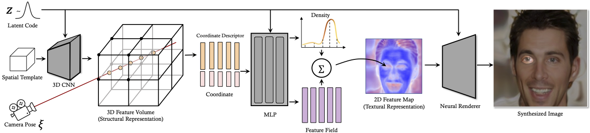

# VolumeGAN - 3D-aware Image Synthesis via Learning Structural and Textural Representations


**Figure:** *Framework of VolumeGAN.*

> **3D-aware Image Synthesis via Learning Structural and Textural Representations** <br>
> Yinghao Xu, Sida Peng, Ceyuan Yang, Yujun Shen, Bolei Zhou <br>
> *Computer Vision and Pattern Recognition (CVPR), 2022*

[[Paper](https://arxiv.org/pdf/2112.10759.pdf)]
[[Project Page](https://genforce.github.io/volumegan/)]
[[Demo](https://www.youtube.com/watch?v=p85TVGJBMFc)]

This paper aims at achieving high-fidelity 3D-aware images synthesis. We propose a novel framework, termed as VolumeGAN, for synthesizing images under different camera views, through explicitly learning a structural representation and a textural representation. We first learn a feature volume to represent the underlying structure, which is then converted to a feature field using a NeRF-like model. The feature field is further accumulated into a 2D feature map as the textural representation, followed by a neural renderer for appearance synthesis. Such a design enables independent control of the shape and the appearance. Extensive experiments on a wide range of datasets show that our approach achieves sufficiently higher image quality and better 3D control than the previous methods.

## Usage

### Setup

This repository is based on [Hammer](https://github.com/bytedance/Hammer), where you can find detailed instructions on environmental setup.

### Test Demo

```shell
python render.py volumegan-ffhq \
    --work_dir ${WORK_DIR} \
    --checkpoint ${MODEL_PATH} \
    --num ${NUM} \
    --seed ${SEED} \
    --render_mode ${RENDER_MODE} \
    --generate_html ${SAVE_HTML}
```

where

- `WORK_DIR` refers to the path to save the results.
- `MODEL_PATH` refers to the path of the pretrained model, regarding which we provide
  - [FFHQ-256](https://www.dropbox.com/s/ygwhufzwi2vb2t8/volumegan_ffhq256.pth?dl=0)
- `NUM` refers to the number of samples to synthesize.
- `SEED` refers to the random seed used for sampling.
- `RENDER_MODE` refers to the type of the rendered results, including `video` and `shape`.
- `SAVE_HTML` controls whether to save images as an HTML for better visualization when rendering videos.

### Training

For example, users can use the following command to train VolumeGAN on FFHQ in the resolution of 256x256

```shell
./scripts/training_demos/volumegan_ffhq256.sh \
    ${NUM_GPUS} \
    ${DATA_PATH} \
    [OPTIONS]
```

where

- `NUM_GPUS` refers to the number of GPUs used for training.
- `DATA_PATH` refers to the path to the dataset (`zip` format is strongly recommended).
- `[OPTIONS]` refers to any additional option to pass. Detailed instructions on available options can be found via `python train.py volumegan-ffhq --help`.

**NOTE:** This demo script uses `volumegan_ffhq256` as the default `job_name`, which is particularly used to identify experiments. Concretely, a directory with name `job_name` will be created under the root working directory, which is set as `work_dirs/` by default. To prevent overwriting previous experiments, an exception will be raised to interrupt the training if the `job_name` directory has already existed. Please use `--job_name=${JOB_NAME}` option to specify a new job name.

### Evaluation

Users can use the following command to evaluate a well-trained model

```shell
./scripts/test_metrics.sh \
    ${NUM_GPUS} \
    ${DATA_PATH} \
    ${MODEL_PATH} \
    fid \
    --G_kwargs '{"ps_kwargs":'{"perturb_mode":"none"}'}' \
    [OPTIONS]
```

## BibTeX

```bibtex
@inproceedings{xu2021volumegan,
  title     = {3D-aware Image Synthesis via Learning Structural and Textural Representations},
  author    = {Xu, Yinghao and Peng, Sida and Yang, Ceyuan and Shen, Yujun and Zhou, Bolei},
  booktitle = {CVPR},
  year      = {2022}
}
```
