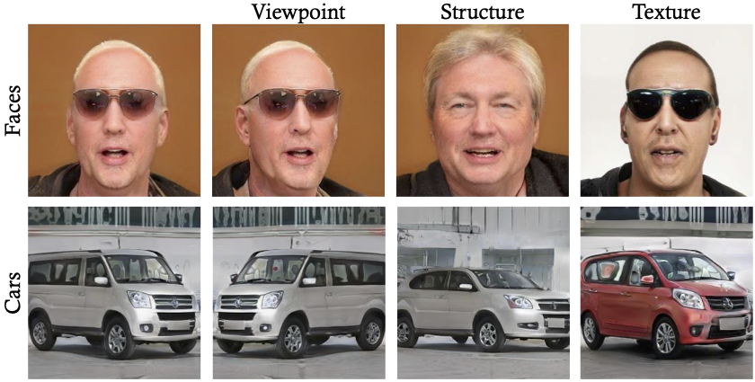
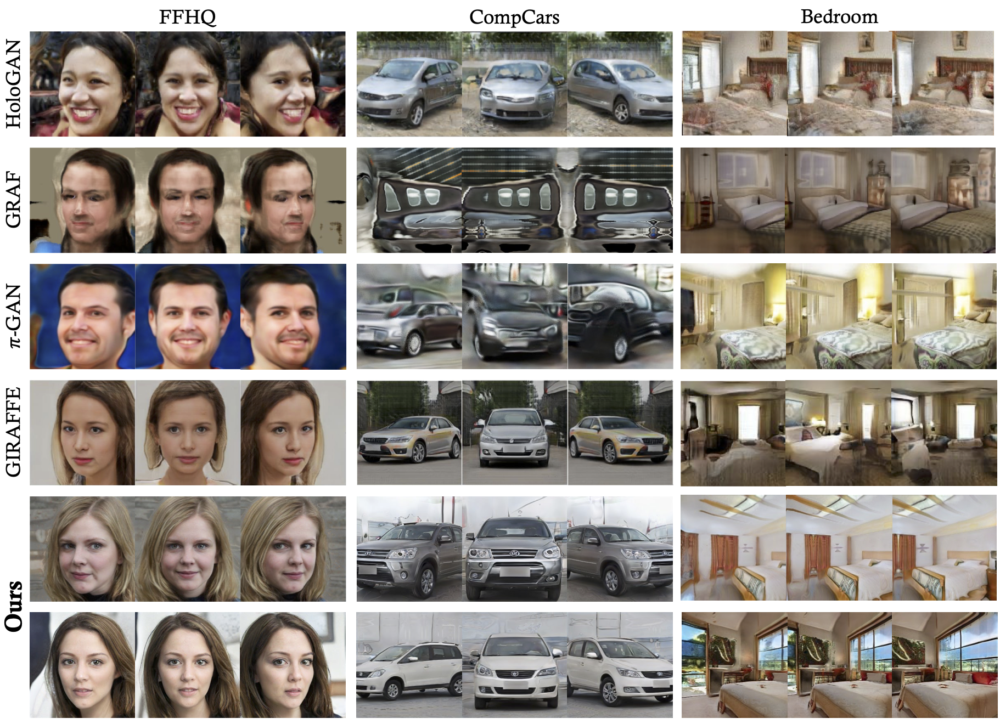

# VolumeGAN - 3D-aware Image Synthesis via Learning Structural and Textural Representations

> **3D-aware Image Synthesis via Learning Structural and Textural Representations** <br>
> Yinghao Xu, Sida Peng, Ceyuan Yang, Yujun Shen, Bolei Zhou <br>
> *arXiv preprint arXiv:*


[[Paper](https://arxiv.org/abs/2112.10759)]
[[Project Page](https://genforce.github.io/volumegan/)]
[[Demo](https://www.youtube.com/watch?v=p85TVGJBMFc)]

This paper aims at achieving high-fidelity 3D-aware images synthesis. We propose a novel framework, termed as VolumeGAN, for synthesizing images under different camera views, through explicitly learning a structural representation and a textural representation. We first learn a feature volume to represent the underlying structure, which is then converted to a feature field using a NeRF-like model. The feature field is further accumulated into a 2D feature map as the textural representation, followed by a neural renderer for appearance synthesis. Such a design enables independent control of the shape and the appearance. Extensive experiments on a wide range of datasets show that our approach achieves sufficiently higher image quality and better 3D control than the previous methods.

## Qualitative Results

Independent control of structure (shape) and texture (appearance).



Comparison to prior work on various datasets.



## Code Coming Soon

## BibTeX

```bibtex
@article{xu2021volumegan,
  title   = {3D-aware Image Synthesis via Learning Structural and Textural Representations},
  author  = {Xu, Yinghao and Peng, Sida and Yang, Ceyuan and Shen, Yujun and Zhou, Bolei},
  article = {arXiv preprint arXiv:2112.10759},
  year    = {2021}
}
```
